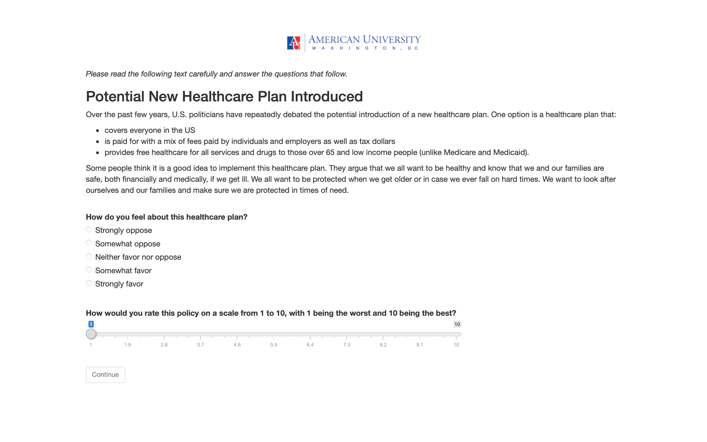

# Setting up and designing an online blocking experiment with `R shiny`

As part of my PhD dissertation, I conducted an online survey experiment on framing, particularly the juxtaposition of moral frames and self-interest frames. Framing is the practice of presenting an issue to affect the way people see it. I wanted to find out whether moral frames affect people more than self-interest frames. Moral frames center around value-based arguments, while self-interest frames are about personal gains. I chose the issues of healthcare and environment and set up 5 treatment groups for each issue. In addition to this substantive analysis, I also wanted to test a blocking method. Respondents were blocked and assigned to treatment groups based on two different sets of education categories. Each set of categories was blocked and assigned separately. Because of this blocking requirement, the most convenient survey questionnaire design provider, Qualtrics, was not an option as it did not offer such a feature. I instead opted to design the experiment with `R shiny`, using the outstanding `R` package [ShinyPsych](https://github.com/mdsteiner/ShinyPsych) as a template. This GitHub repository contains the code to set up and run this `shiny` app. In the spirit of open science, I want to make the code publicly available to potentially inspire others who wish to use `R shiny` for their survey experiments. Note: This is not an `R` package designed for generic use. It is merely an adaptation of `ShinyPsych` to work with more complex `R` code that is specifically designed for my research purposes. The code will thus not work 'out of the box'.

# Required setup

* `R` and `RStudio`
* `R` packages:
    + `blockTools`
    + `stringr`
    + `ShinyPsych`
    + `shinyjs`
    + `plyr`
    + `rdrop2`
    + `rsconnect`
    + `shiny`
    + `here`
* A [shinyapps.io](https://www.shinyapps.io) account
* A [Dropbox](https://www.dropbox.com) account

# General structure

The code is designed like any `shiny` app. The specific app layout is explained [here](https://rpubs.com/msteiner/ShinyPsych_SurveyTutorial). While my code makes several adjustments to the package template, the basic structure remains the same.

Questions are created and stored in `.txt` files. An excellent detailed explanation of the inner workings is provided [here](https://rpubs.com/msteiner/ShinyPsych_TextfileTutorial). The `.txt` files contain the actual questions as well as the type of question (e.g. user input or radio buttons), the response choices (e.g. 5 different radio buttons), the response names (e.g. 5 different races) and whether the question order should be randomized, among several other things. While it is possible to set up and edit these parameters directly in `.txt` files, the potential for errors is high as these files are space-sensitive. It is recommended to carry out edits in `.csv` files and subsequently transform these to `.txt`. The code to do so is included in `edit_package.R`.

In order to upload/download data to/from Dropbox, you need a Dropbox token named `droptoken.rds` in the `/survey_experiment` folder. You can create a Dropbox token with instructions from [rdrop2](https://github.com/karthik/rdrop2). The code to do so is included in `edit_package.R`. Since a Dropbox token guarantees anyone with it access to the Dropbox account, my personal token is not included in the folder. 
`edit_package.R` also includes several other `rdrop2` functions to analyze the eventual data, such as `drop_read_csv()`, `drop_dir()`, `drop_is_folder()`, and `drop_download()`. The latter is also used in the app itself, together with `drop_upload()`, to upload and download data to and from Dropbox. 
The code requires specified folders to communicate with Dropbox. These are: `alldata.op`, `alldata.an`, `seqblock.op`, and `seqblock.an` (the endings `.op` and `.an` refer to the two differing sets of education categories used for blocking). The first two store the `.csv` files. The latter two store the `.Rdata` files that result from blocking. All folder names are arbitrary respective to substantive use.
Each respondent's answers are saved in a separate `.csv` file. All respondents' blocking assignments are stored in a cumulative `.Rdata` file. For 100 respondents, for instance, Dropbox stores 100 `.csv` file and one `.Rdata` file.

# Content of the repository

## `/blocking_testing_dropbox`

A supplemental folder where I tested the interaction between the blocking algorithm and Dropbox. It is easiest to test this outside of `shiny`. This folder is not required for the functioning of the app.

## `edit_package.R`

A supplemental file that contains helpful code when setting up and designing the app. The first section creates and saves the Dropbox token. The second section transforms `.csv` files in the `/questions` folder to `.txt` files (whilst retaining the original `.csv`) and copies these over to the app. The third section runs the app locally. The fourth section (re-)deploys the app to the `shinyapps.io` server. The fifth section downloads collected survey data from Dropbox (for `.csv` and `.Rdata` files). Since the app saves each respondent's answers in a separate `.csv` file, the code for `.csv` files contains a function that downloads all files, collects them into a list, turns the list into a data frame, and saves the data frame as one collective `.csv` file to a local folder in order to enable data wrangling and analysis.

## `/previous_working_versions`

A supplemental folder that contains previous working versions of the app. I developed the overall structure in the spring of 2019 and then extensively modified the code to reflect dissertation developments in late 2020, immediately before the survey was fielded. This folder is not required for the functioning of the app.

## `/questions`

A supplemental folder that contains all the survey questions, including instructions and treatment, in `.csv` and `.txt.` form. Treatment question are in a subfolder for organization reasons. While this folder is not required for the functioning of the app, it is tremendously useful for modifications and edits. As mentioned above, it is rather risky to edit the questions directly in `.txt` form due to the high potential for errors. It is much easier to do so in `.csv` form. This folder thus keeps both versions. I highly recommend keeping this folder outside of the actual app to avoid messing up previously working `.txt` files. Copying the files into the app is easily set up directly in `R` (see `edit_package.R`). In my experiment, I use standard questions on demographics, party ID and ideology, as well as questions to assess respondents' levels of morality and self-interest and five treatment questions for each issue (healthcare and environment).

## `/survey_experiment`

This folder contains the actual app. All folders and files outside of this folder are purely for supplemental reasons. Respondents will only see content that is in this folder. `app.R` contains the `shiny` app. `\questions`, identical to above, contains all questions and instructions in `.txt` files. `/rsconnect` is created automatically when the app is deployed on [shinyapps.io](https://www.shinyapps.io). `sessionsInfo.txt` lists the OS, R version as well as all packages at the time of usage. `/www` contains external files to be shown in the questionnaire. In my case, these are my university logos. This folder also contains the Dropbox token, named `droptoken.rds`. The app does not work without this token. For privacy reasons, my personal token is not included, as mentioned above.

### `app.R`

The app consists of preliminary code before the app and subsequently the app itself. The preliminary code includes JavaScript sections to work in HTML redirects for Lucid, a specification which platform the codes is to be fielded on (Lucid or Mturk), Dropbox directories, functions that upload/download a file to/from Dropbox and overwrite any pre-existing files, names for question files to be used later in the code, a vector with page IDs used to access objects, specifications for the blocking code, and two lists of healthcare/environment treatment questions.

The app code consists of the ui function and the server function. The ui function is a fixed page that includes JavaScript functions to handle the HTML redirects for Lucid. The server function contains code to pull in the Lucid unique respondent ID, the blocking code (section A), the skip logic (section B), the page layouts (section C), the page navigation buttons (section D), event control (section E), and code to save and upload the collected responses (section F). Finally, the app is run. All code is extensively commented to ease understanding.

# Usage

Please feel free to use any parts of this code for your own research purposes. If you have any questions about the workings of the code or how to adapt any sections for your needs, you can contact me any time. Similarly, if you would like to know more about my dissertation (though I doubt anyone would want to go down this rabbit hole), please reach out any time.

